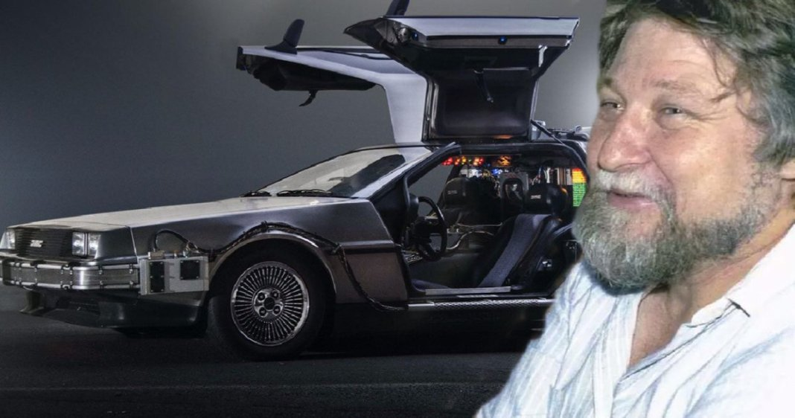
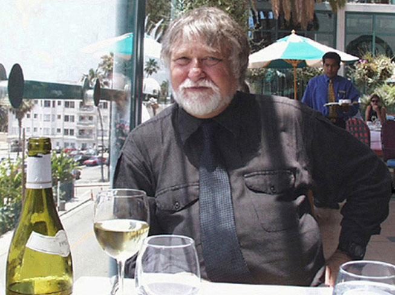
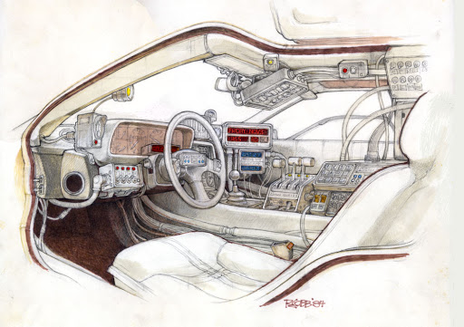
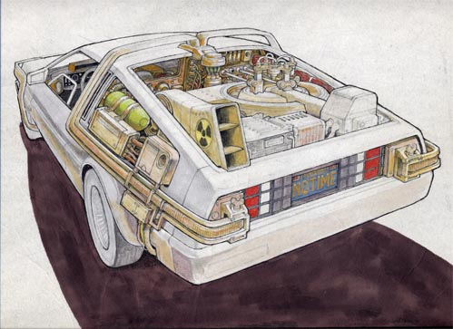

# The artist Ron Cobb died. He designed the DeLorean machine from "Back to the Future".

In Sydney, Ron Cobb, the art director who worked on films Alien and Back to the Future, died. His wife, Robin Love, informed about it. Cobb died on September 21, the day he turned 83.

Cobb was born in 1937 in Los Angeles. His career began at the Disney Company when he was 17 years old. The first film, to which he put his hand, was "Dark Star" - the directorial debut of John Carpenter.

During his career, Cobb came up with the design of a time machine DeLorean DMC-12 from "Back to the Future", the ship "Nostromo" from "Alien" and the scenery "Conan the Barbarian". Among his other works are creatures from "Star Wars" and a colony of earthlings from "Aliens".

In the early 1980s, Cobb met Stephen Spielberg, who offered him to shoot the fantasy Night Sky. Cobb refused, but played the doctor's cameo in a future film directed by Alien.

Ron Cobb, the artist, cartoonist, film designer and writer lives in Sydney, Australia with his Australian wife Robin Love and teenage son, Nicky, but you can sometimes find him in Los Angeles, California (he was born and raised there).

His cartoons from the sixties and seventies are collected in several out of print books: RCD-25 (1967) and Mah Fellow Americans (1968) were published by Sawyer Press. Raw Sewage and My Fellow Americans (1971) were published by Price Stern and Sloan.

After he moved to Sydney in 1972, with the independent publishers Wild and Woolley he published a "best of" the earlier cartoon books titled The Cobb Book in 1974. This was followed in 1976 by Cobb Again.

A large format collection in full color was published in 1981 by titled Colorvision. This book included much of his design work for the films Star Wars, Alien and Conan the Barbarian. Conan was the first feature for which he received the credit Production Designer.

 

In the last two decades Ron Cobb has contributed production design to the films: The Last Starfighter, the aforementioned Conan the Barbarian, and Leviathan.

He also contributed conceptual designs to other feature films, including Dark Star, Alien, Close Encounters of the Third Kind, Real Genius, Back to the Future, Aliens, The Abyss, Total Recall, True Lies, The 6th Day, Cats and Dogs, Firefly and Southland Tales.

Ron directed the Australian comedy Garbo and contributed the original story for Night Skies, an earlier, darker version of ET. He also co-wrote with Robin Love, one of the new Twilight Zone episodes.
